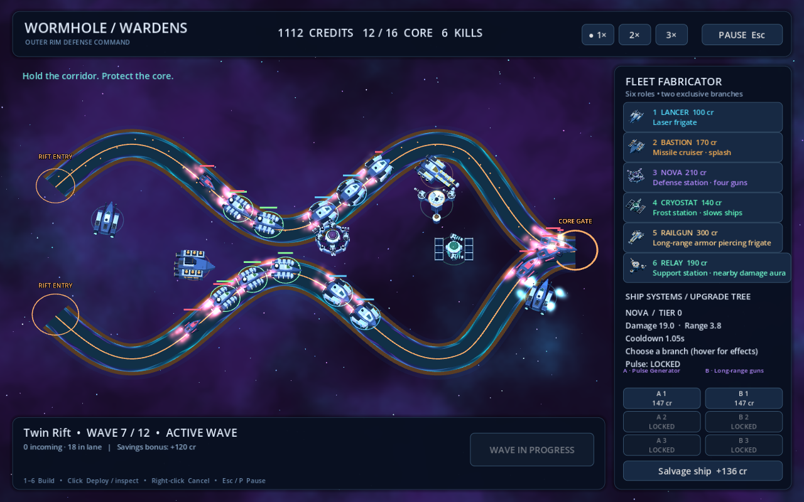
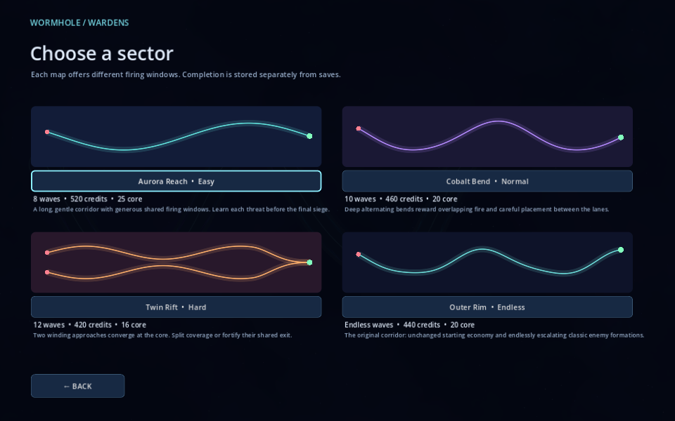
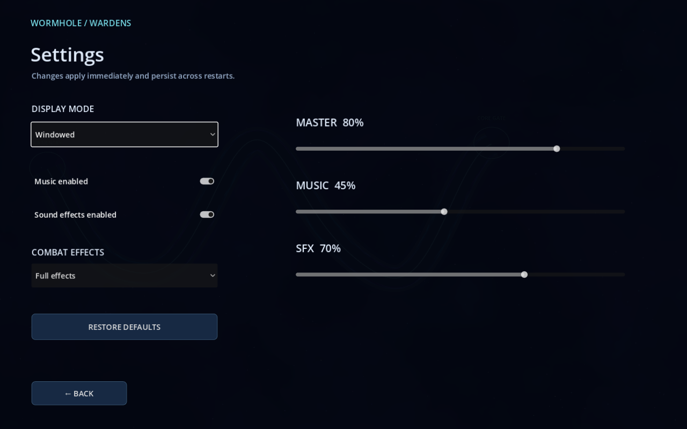

# Wormhole Wardens

A 3D space tower defense game built with Godot 4.7 and GDScript, with original Blender models and procedural audio. Defend three finite sectors or replay the original endless corridor with six fleet roles, branching upgrades, persistent saves, and map completion progress.



## Play and controls

Double-click `Launch.cmd` on this machine, or import `project.godot` in Godot and run the project. The launcher imports assets before starting and uses its configured Godot installation path; update `WARDENS_GODOT` in `Launch.cmd` for another installation.

Start with **New Game**, choose a sector, and deploy your fleet during preparation. **Load Game**, **Settings**, and **Quit** are available from the main menu. A current run also enables **Continue / Resume** and, between waves, **Save Game**.

- Press **1–6** or select a fleet button, then click the map to deploy. Keep clicking to place more of the same type.
- A green range ring marks a valid position; red means blocked or unaffordable. Towers cannot overlap any wormhole route, another tower, or the map boundary.
- **Right-click** cancels construction. **Escape** first cancels construction; otherwise it pauses gameplay or goes back through menus. **P** also opens pause during gameplay. Choose **Resume** or press **Escape** from the pause menu to continue.
- Click an existing tower to inspect, upgrade, or salvage it. Each tower has two exclusive branches with three tiers. Upgrade nodes show **PURCHASED**, **LOCKED**, **NEED CREDITS**, or the available cost. Hover a node or focus it with the keyboard to inspect its effect and stat comparison.
- Select the labeled **1×**, **2×**, or **3×** HUD buttons to change simulation speed. Pausing freezes movement, spawning, weapons, damage, rewards, and gameplay effects, and blocks fleet purchases, upgrades, salvage, and wave starts. Resume retains the selected speed; music pitch stays unchanged.
- **Tab / Shift+Tab** moves keyboard focus; **Enter** selects a focused action. Menus provide visible focus and consistent Back/Escape navigation.

**Next Wave** always stays under player control. Preparation previews the next formation, boss warnings, completion credits, and no-purchase bonus. Kill rewards are immediate; clearing a wave grants its configured completion reward and a bonus if no tower or upgrade was purchased during that wave. Purchases between waves preserve the next bonus; salvage does not forfeit it. Outer Rim retains the original bonus formula, `45 + 10 × wave`.

The HUD shows current/final wave, credits, kills, and surviving core integrity. Finite maps end in victory only after their last wave has finished spawning and every enemy is resolved with the core surviving. A lost core ends the run immediately. Results show map, difficulty, completed waves, kills, and core integrity, with Replay, Map Selection, and Main Menu actions. Completed maps receive a persistent badge.

## Sectors

| Map | Difficulty | Waves | Starting credits | Core | Layout |
| --- | --- | ---: | ---: | ---: | --- |
| Aurora Reach | Easy | 8 | 520 | 25 | Broad winding bends with generous shared coverage |
| Cobalt Bend | Normal | 10 | 460 | 20 | Alternating turns and compact firing windows |
| Twin Rift | Hard | 12 | 420 | 16 | Two approaches converging on one core |
| Outer Rim | Endless | Unlimited | 440 | 20 | The original corridor and classic scaling rules |

Finite formations introduce fast, armored, shielded, and regenerating ships before combining them into dense milestone waves. Shields absorb damage before hull; armor reduces individual hits; regenerators repair surviving hulls. Cryogenic slowing uses the strongest active slow, with resistance on tougher enemies. Dreadnoughts deal four core damage. Railguns counter armor, while concentrated fire helps overcome shields and repairs. Outer Rim preserves its original enemy and economy behavior.



## Fleet

Damage and cooldown are base values before upgrades, nearby support, shields, or armor. Nova's damage is per independently aimed gun; Relay's two mounts share one hit.

| Key | Tower | Cost | Damage | Range | Cooldown | Role and branches |
| --- | --- | ---: | ---: | ---: | ---: | --- |
| 1 | Lancer | 100 | 14 | 5.1 | 0.48 s | Rapid laser; Overcharged beams / Long-range optics |
| 2 | Bastion | 170 | 42 | 6.4 | 1.65 s | Missile with 1.5 splash radius; Heavy warheads / Rapid launchers |
| 3 | Nova | 210 | 19 per gun | 3.8 | 1.05 s | Four independent guns; Pulse Generator / Long-range guns |
| 4 | Cryostat | 140 | 5 | 4.6 | 0.70 s | Beam slows for two seconds; Deep freeze / Combat coolant |
| 5 | Railgun | 300 | 118 | 8.2 | 2.35 s | Long-range armor piercing; Kinetic accelerator / Targeting array |
| 6 | Relay | 190 | 7 | 5.6 | 1.10 s | Nearby damage +18%; Power amplification / Extended relay |

Only the strongest nearby Relay aura applies to another tower; multiple auras never add or multiply. Its amplification branch increases the bonus, while its extended branch increases both coverage and the bonus.

Nova's guns keep separate enemy locks, spreading across up to four targets in range. Spare guns share a target when fewer enemies are available; lost or out-of-range targets are replaced automatically. Each aligned gun deals its own damage on the shared cooldown. A newly built Nova has no area attack.

The first **Pulse Generator** upgrade costs 147 credits and unlocks an additional area pulse without increasing gun damage. Later Pulse Generator tiers increase gun and pulse damage by 65% and range by 0.25. The exclusive Long-range guns branch increases gun range and damage but never unlocks the pulse. Buying the pulse during combat forfeits that wave's no-purchase bonus like any other upgrade.

## Saves and settings

Saving is available **only during preparation between waves**, including from the pause menu or main menu while a preparation run remains in memory. Combat saves are clearly disabled. Three slots show map, difficulty, completed wave, and UTC timestamp. Overwriting or deleting a slot requires confirmation; starting another run, loading another save, or quitting asks before discarding unsaved progress. Returning to the main menu keeps the current run available to resume.

Versioned saves live under Godot's `user://wardens/` directory. They retain map, economy, kills, core, speed, tower positions, stable tower/branch IDs, and purchased tiers, including Nova's pulse unlock. Loading reconstructs the fleet without duplicate charges or rewards. Writes use a verified temporary file and retain the previous valid `.bak` recovery copy. Corrupt or incompatible saves show an error while preserving the live run; recoverable slots identify their recovery copy. Map completion and global settings are separate from run slots.

Settings are available from both main and pause menus. **Fullscreen / Windowed** is a mutually exclusive choice that applies immediately and remembers a usable window size. **Music** and **SFX** have independent enable toggles; **Master**, **Music**, and **SFX** have separate percentage sliders. Changes persist across restarts and apply before playback. **Restore Defaults** restores windowed 1440 × 900, both audio categories enabled, and volumes of 80% Master, 45% Music, and 70% SFX. The UI uses a 1440 × 900 design viewport and preserves its aspect ratio when resized.

Original menu and gameplay instrumentals loop seamlessly and crossfade between contexts. Separate weapon, impact, engine, fleet, UI, wave, reward, core, victory, and defeat cues use bounded voice counts and repeat limits. Music continues while paused; existing effects stop, combat cues remain blocked, and menu feedback stays available.



## Models, effects, and regeneration

Ships and stations have complete three-dimensional hulls and undersides. Materials embed base-color, roughness, and normal textures, with metallic armor, cockpit glazing, emissive reactors, and radiator cells. Editable PNG maps are in `assets/textures/`; `.blend` sources pack their maps for portability. Exported static parts are batched by material.

Nova mounts four independent twin-barrel turrets, Cryostat mounts two coil projectors, and Relay mounts two defense guns. Assemblies attach to `GunSocket_*` nodes on fixed station bodies, with yawing heads, `BarrelPivot` elevation/recoil, and `Muzzle_*` firing origins. Station bodies stay fixed while their guns aim.

The Lancer turns using opposing bow/stern thrusters, with jets on the side opposite the required force. Hits emit sparks; destroyed ships collapse inward. `scripts/effects/space_fx.gd` maintains a bounded particle pool for maneuvering jets, engine trails, impacts, and implosions. Purchase icons render the actual assembled models.

From the repository root, regenerate the original fleet first, then expansion models and icons. Blender is required only to regenerate model assets; Python's standard library is sufficient for audio.

```text
blender --background --python tools/asset_pipeline/build_models.py
blender --background --python tools/asset_pipeline/render_fleet_icons.py
blender --background --python tools/asset_pipeline/build_expansion_models.py
blender --background --python tools/asset_pipeline/render_expansion_icons.py
python tools/asset_pipeline/generate_audio.py
```

`build_models.py` delegates to `build_detailed_models.py`. Renderers preserve game materials. `docs/model_previews/fleet_gallery.png`, `nova_side.png`, `expansion_gallery.png`, `expansion_relay_side.png`, and `expansion_railgun_underside.png` document assembled models and underside detail. Models, textures, icons, and generated audio are original project assets with no external sample or stock-asset attribution requirements.

## Checks and project structure

See the [project structure guide](docs/PROJECT_STRUCTURE.md) for the directory layout, where new files belong, resource-move rules, and asset-generation paths. Scene-specific scripts are colocated under `scenes/`; shared logic is under `scripts/`; runtime assets are under `assets/`; Blender sources and generators are under `art/` and `tools/`.

Run the automated suite from PowerShell:

```powershell
.\tests\run_checks.ps1
# Optional: select a different Godot console executable.
.\tests\run_checks.ps1 -Godot 'C:\path\to\Godot_console.exe'
# Also render all screens and verify settings across three application launches.
.\tests\run_checks.ps1 -CaptureUI
```

The checks cover content definitions and legacy parity, placement/economy, combat and end states, station mounts, thrusters and effects, independent Nova locks and pulse unlocks, preparation saves and corruption recovery, settings/audio, menu confirmations, and integrated session flow. Save tests use isolated temporary storage instead of player slots.

Individual gameplay checks use `Godot --headless --path . -- --smoke-test`, replacing the final flag with `--combat-test`, `--vfx-test`, `--station-test`, `--nova-target-test`, `--nova-pulse-test`, `--integration-test`, or `--menu-test`. Standalone checks use `--script tests/content_data_test.gd` or `--script tests/storage_test.gd`.

`--balance-test` runs automated campaign strategies against legal budgets and placement. `--performance-test` exercises a bounded dense-combat workload; run it with rendering enabled when assessing frame timing. These checks support tuning and regression detection; see the balance and performance reports for their workloads and limitations.

Run `Godot --path . -- --capture` to refresh `docs/screenshots/gameplay.png`. Run `Godot --path . -- --ui-capture` with a display to capture menus, gameplay, pause, results, and fullscreen under `work/ui_*.png`. The published map/settings examples above are stored in `docs/screenshots/`.

`scripts/data/game_data.gd` defines stable maps, waves, enemies, towers, and upgrades. `scenes/gameplay/main.gd` manages simulation and session flow; `scenes/ui/game_menu.gd` builds navigation; `scripts/services/run_storage.gd`, `scripts/services/game_settings.gd`, and `scripts/services/game_audio.gd` handle persistence and audio. `assets/shaders/wormhole.gdshader` and `assets/shaders/nebula.gdshader` draw the lane and backgrounds.

Further details: [Content and rules](docs/CONTENT.md), [Persistence](docs/PERSISTENCE.md), [Audio](docs/AUDIO.md), [Fleet assets](docs/ASSETS.md), [Balance](docs/BALANCE.md), and [Performance](docs/PERFORMANCE.md), and [Acceptance evidence](docs/ACCEPTANCE.md).
